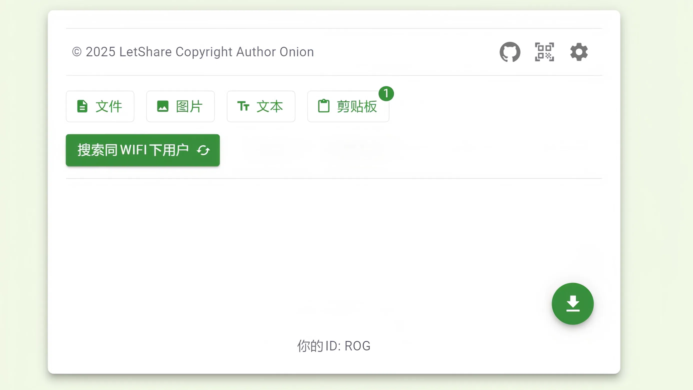
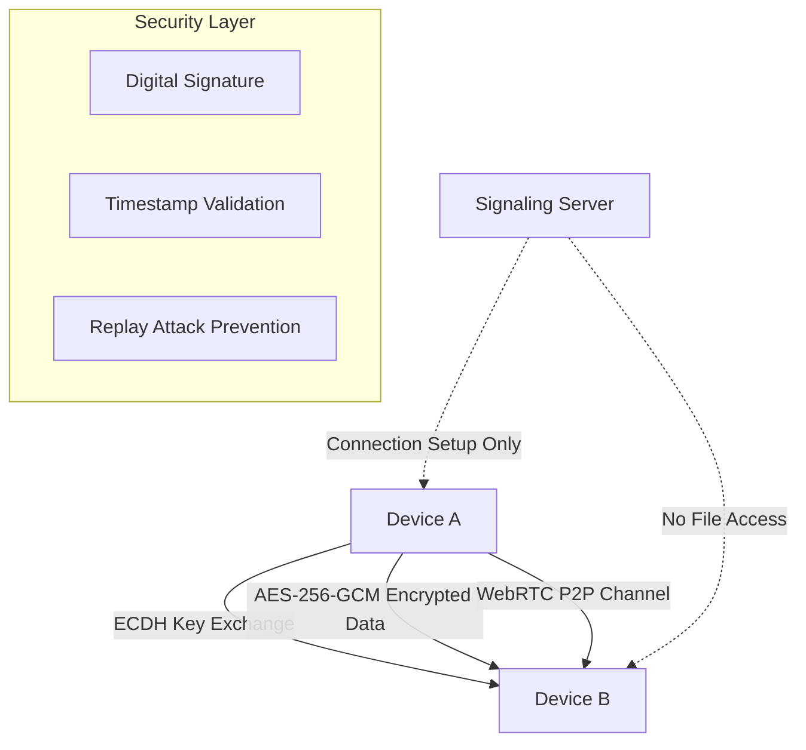

# 🚀 LetShare - Lightning-Fast Secure File Sharing

> **Zero Registration | End-to-End Encrypted | Instant P2P Transfer | Cross-Platform**

[](https://letshare.fun)
[](#security)
[](#cross-platform)

[](LICENSE)  
[](https://vitejs.dev)  
[](https://webrtc.org)

**[🇨🇳 中文版](./documents/README-CN.md)**

---

## 🎯 Why LetShare?

**❌ Traditional file sharing pain points:**
- Upload to cloud servers → Privacy risks & slow speeds
- Registration required → Friction and data collection  
- Platform limitations → iPhone ↔ Android struggles
- File size restrictions → Can't share what you need

**✅ LetShare solves it all:**
- 🚀 **Direct P2P transfer** - Your network speed = transfer speed
- 🔐 **Military-grade encryption** - Even we can't see your files
- 📱 **Universal compatibility** - Any device, any platform
- ⚡ **Instant connection** - Scan QR code, start sharing

---

## ✨ Core Features

### 🔐 **Enterprise-Grade Security**
- **End-to-End Encryption**: ECDH + AES-256-GCM
- **Digital Signatures**: ECDSA verification prevents tampering
- **Anti-MITM Protection**: Public key signature validation
- **Zero Server Storage**: Files never touch our servers

### ⚡ **Lightning Performance**
- **WebRTC P2P**: Direct device-to-device connection
- **No Upload Delays**: Skip the cloud, transfer directly
- **Unlimited File Size**: Only limited by your storage
- **Real-time Progress**: Live transfer monitoring

### 🌍 **Universal Compatibility**
- **Web Browser**: Chrome, Firefox, Safari, Edge
- **Mobile Native**: Android app via Capacitor
- **Cross-Platform**: Windows ↔ Mac ↔ Linux ↔ Mobile
- **PWA Support**: Install as native app

### 🎯 **Zero Friction Experience**
- **No Registration**: Open and use immediately
- **QR Code Pairing**: Scan to connect instantly
- **Drag & Drop**: Intuitive file sharing
- **Multi-language**: English, 中文, Bahasa, Indonesia

---

## 🎬 See It In Action



**🔥 30-Second Workflow:**
1. Open LetShare on both devices
2. Scan QR code to connect
3. Drag files or paste text
4. Watch encrypted transfer in real-time

---

## 🏗️ Technical Architecture



**🔧 Tech Stack Highlights:**
- **Frontend**: React 18 + TypeScript + Vite
- **P2P**: WebRTC DataChannels
- **Encryption**: Web Crypto API (ECDH/ECDSA/AES-GCM)
- **UI**: Material-UI (MUI) 5
- **State**: MobX for reactive updates
- **Mobile**: Capacitor for native apps
- **I18n**: react-i18next with auto-detection

---

## 🚀 Quick Start

### 🌐 **Try Online (Recommended)**
```bash
👉 Visit: https://letshare.fun
```
No installation needed - works instantly in any modern browser!

### 💻 **Local Development**
```bash
# Clone the repository
git clone https://github.com/LiWeny16/LetShare.git
cd LetShare

# Install dependencies
yarn install

# Start development server
yarn dev

# Build for production
yarn build
```

### 📱 **Build Android App**
```bash
# Setup Capacitor
yarn app-create

# Build and sync
yarn app

# Open in Android Studio
yarn app-start
```

---

## 🔐 Security Features {#security}

### **Encryption Pipeline**
1. **Key Generation**: ECDH P-256 key pairs per user
2. **Key Exchange**: Signed public key distribution
3. **Shared Secret**: ECDH-derived AES-256 keys
4. **Message Encryption**: AES-256-GCM with authentication
5. **Integrity**: ECDSA signatures prevent tampering

### **Attack Protection**
- ✅ **Man-in-the-Middle**: Public key signature validation
- ✅ **Replay Attacks**: Timestamp + nonce verification  
- ✅ **Data Tampering**: Cryptographic authentication
- ✅ **Eavesdropping**: End-to-end encryption

---

## 📊 Comparison Matrix

| Feature | LetShare | AirDrop | WeTransfer | Google Drive |
|---------|----------|---------|------------|--------------|
| **Cross-Platform** | ✅ Universal | ❌ Apple Only | ✅ Web | ✅ Web |
| **Privacy** | ✅ E2E Encrypted | ✅ Local | ❌ Server Access | ❌ Server Scan |
| **Speed** | ✅ P2P Direct | ✅ Local | ❌ Upload/Download | ❌ Rate Limited |
| **File Size** | ✅ Unlimited* | ❌ Limited | ❌ 2GB Max | ❌ 15GB Quota |
| **Registration** | ✅ None | ✅ None | ❌ Required | ❌ Required |
| **Offline** | ✅ LAN Works | ✅ Local | ❌ Internet Only | ❌ Internet Only |

*Limited by device storage and network stability

---

## 🌍 Supported Platforms 

### **Web Browsers**
- ✅ Chrome 88+ (Recommended)
- ✅ Firefox 84+
- ✅ Safari 14+
- ✅ Edge 88+

### **Mobile Platforms**
- ✅ Android 7.0+ (Native app)
- ✅ iOS 14+ (PWA)
- ✅ Any mobile browser

### **Desktop OS**
- ✅ Windows 10+
- ✅ macOS 10.15+
- ✅ Linux (Any distribution)

---

## 🛠️ Development Scripts

```bash
yarn dev
yarn build       
```

---

## 🤝 Contributing

We welcome contributions! Here's how you can help:

### **🐛 Found a Bug?**
- Open an [issue](https://github.com/LiWeny16/LetShare/issues) with reproduction steps

### **💡 Have Ideas?**
- Check our [roadmap](https://github.com/LiWeny16/LetShare/projects) 
- Suggest features in [discussions](https://github.com/LiWeny16/LetShare/discussions)

### **🚀 Want to Contribute Code?**
1. Fork the repository
2. Create your feature branch: `git checkout -b feature/amazing-feature`
3. Commit changes: `git commit -m 'Add amazing feature'`
4. Push to branch: `git push origin feature/amazing-feature`
5. Open a Pull Request

---

## 📝 License

This project is licensed under the **MIT License** - see the [LICENSE](LICENSE) file for details.

---

## ⭐ Support This Project

If LetShare helps you, please consider:

- ⭐ **Star this repository** to show your support
- 🐛 **Report bugs** to help us improve
- 💡 **Share ideas** for new features
- 🔄 **Share with friends** who need secure file sharing
- ☕ **[Buy us a coffee](https://ko-fi.com/bigonion)** to fuel development

---

## 🔗 Links

- 🌐 **Live Demo**: [letshare.fun](https://letshare.fun)
- 📱 **Android App**: [Google Play Store](https://play.google.com/store/apps/details?id=fun.letshare.app)
- 📧 **Contact**: [hello@letshare.fun](mailto:hello@letshare.fun)
<!-- - 🐦 **Twitter**: [@LetShareApp](https://twitter.com/LetShareApp) -->

---

<div align="center">

**Built with ❤️ by developers who believe in privacy and simplicity**

[⬆ Back to Top](#-letshare---lightning-fast-secure-file-sharing)

</div>

