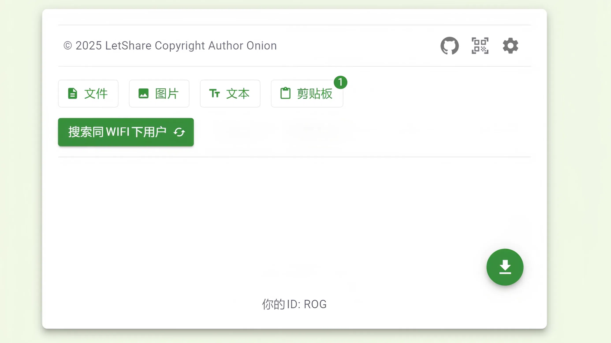

# LetShare

Browser-first cross-device sharing for files, images, clipboard text, and short messages.

[English](./README.md) | [简体中文](./README.zh-CN.md)

- Production: [letshare.fun](https://letshare.fun)
- Android: [Google Play](https://play.google.com/store/apps/details?id=fun.letshare.app)

## Current Stable Release

`v3.5.6` is the current stable release, published on July 29, 2026.

This release includes the transfer reliability update: 10-minute background server retention, relay resume hardening, direct-to-disk receive improvements, PWA asset cleanup fixes, and corrected P2P fallback status to avoid showing a disconnect toast before the initial DataChannel connection has ever opened.

Release baseline:

| Surface | Reference |
| --- | --- |
| Frontend | `0126bee` |
| Backend | `ec8ef1c` |



## Why LetShare

Moving files between your own devices is still more annoying than it should be.

- AirDrop is excellent inside the Apple ecosystem, but it does not cover iPhone to Android, Android to PC, or other mixed-device workflows.
- Cloud drives and chat apps add upload time, login friction, storage management, link cleanup, and often leave a third-party copy behind.
- LAN sharing tools often require an app install, the same Wi-Fi network, or manual IP and port setup.
- Pure WebRTC transfer is fast when it connects, but NAT, mobile networks, corporate firewalls, and browser tab suspension can break direct P2P.
- Large files need predictable behavior: users should know whether the sender is using direct P2P or the public relay.

LetShare focuses on the missing middle: open a room in the browser, connect another device by QR code or link, then choose the transfer route that fits the current network.

## Features

| Area | What it does |
| --- | --- |
| Cross-device sharing | Share files, images, clipboard text, and chat-style file messages between devices. |
| Sender-controlled route | Choose direct P2P when it works, or public relay when the current network needs it. |
| Browser-first use | Works in modern desktop and mobile browsers, with PWA support. |
| Android build | The web app can be packaged through Capacitor for Android. |
| Relay limits | Free public relay transfers are capped at 50 MB. PRO relay transfers can exceed 50 MB up to the configured 3 GB ceiling. |
| Local persistence | Chat file messages and received file metadata use browser storage where supported. |

## Transfer Modes

| Mode | Best for | Route | Limits and notes |
| --- | --- | --- | --- |
| P2P WebRTC | Nearby devices, same LAN, or networks where direct peer connection succeeds | Browser to browser through WebRTC DataChannel | No LetShare relay file-size gate. Practical limits come from browser memory, device storage, and network stability. |
| Public relay | Networks where P2P fails, cross-network transfer, or sender-selected server route | Sender to LetShare WebSocket relay to receiver | Free relay transfers are capped at 50 MB. PRO relay transfers can exceed 50 MB up to 3 GB. |
| Ably/global signaling | Room discovery and signaling where the default global path works best | Signaling only | Ably is not the binary file relay path. Large public-relay transfer requires the Custom WebSocket provider. |

Relay transfers are forwarded during the active session. LetShare is not a cloud-drive product and should not be treated as durable file storage.

## Typical Workflow

1. Open [letshare.fun](https://letshare.fun) on the sending device.
2. Open the same room on the receiving device by QR code or link.
3. Choose the route on the sender side: P2P for direct transfer, or public relay when the network needs it.
4. Send text, images, or files and watch transfer progress in the browser.

## Privacy and Security Boundaries

LetShare reduces unnecessary cloud upload and account friction, but the trust boundary depends on the selected route.

- P2P transfer sends file data directly between browsers after signaling.
- Public relay transfer forwards chunks through the LetShare WebSocket server during the active transfer.
- The relay service enforces the free/PRO size gate from server-side authorization, not just from UI state.
- The app uses browser crypto and signed peer messaging primitives in its connection layer.
- Files are not intended to be retained by the relay as a storage service.

Do not treat public relay transfer as the same privacy model as pure P2P. If you need the strictest path, use P2P when it connects.

## Supported Platforms

| Platform | Status |
| --- | --- |
| Chrome, Edge, Firefox, Safari | Supported on current modern versions |
| iOS/iPadOS | Supported through the browser/PWA path |
| Android | Supported through browser/PWA and Capacitor Android app |
| Windows, macOS, Linux | Supported through modern desktop browsers |

The UI includes English, Simplified Chinese, Bahasa Melayu, and Indonesian translations.

## Tech Stack

| Area | Stack |
| --- | --- |
| Frontend | React 18, TypeScript, Vite |
| UI/state | Material UI, MobX |
| P2P | WebRTC DataChannels |
| Signaling/relay | Ably provider and custom Go WebSocket server |
| PWA | vite-plugin-pwa |
| Mobile | Capacitor Android |
| Backend | Go 1.21, Gin, Gorilla WebSocket |

## Local Development

This repository uses `pnpm`.

```bash
pnpm install
pnpm dev
```

Frontend commands:

| Command | Purpose |
| --- | --- |
| `pnpm dev` | Start the Vite development server |
| `pnpm test` | Run the TypeScript test suite under `tests/*.test.ts` |
| `pnpm test:unit` | Run focused file-message unit tests |
| `pnpm test:e2e` | Run focused file-message end-to-end tests |
| `pnpm build` | Type-check, build to `docs/`, fix dotfiles, and generate `version.json` |
| `pnpm preview` | Preview the production build locally |

Backend commands:

```bash
cd server
go mod download
go test ./internal/... -count=1
go run ./cmd/server
```

Local CI helper:

```bash
node scripts/ci-local.cjs --frontend
node scripts/ci-local.cjs --backend
```

The custom WebSocket server provides room coordination, signaling, and server-relayed file transfer. Production relay limits are configured on the backend; the current public relay model is free up to 50 MB and PRO up to 3 GB.

## Android Build

```bash
pnpm app-create
pnpm app
pnpm app-start
```

`pnpm app-create` adds the Android platform, `pnpm app` builds and syncs the web app into Capacitor, and `pnpm app-start` opens the project in Android Studio.

## Project Structure

| Path | Purpose |
| --- | --- |
| `src/` | React application, connection providers, chat/file-transfer UI, state, and i18n |
| `server/` | Go WebSocket backend and relay service |
| `tests/` | Node/tsx tests for file messaging and storage behavior |
| `docs/` | GitHub Pages production build output |
| `documents/` | Store assets, screenshots, and supporting documents |
| `scripts/` | Build, cleanup, version, CI, and deployment helper scripts |
| `android/` | Capacitor Android project |
| `Harness/` | Agent workflow scaffold, task history, and project notes |

## Deployment Notes

| Surface | Notes |
| --- | --- |
| Frontend | Vite builds into `docs/`, which is used for GitHub Pages. |
| CDN | The public site is served through CDN in front of GitHub Pages. |
| Backend | The custom WebSocket backend is deployed separately from the static frontend. |
| Versioning | For app or service-worker changes, keep `package.json`, `src/app/libs/mobx/mobx.ts`, the service worker cache name in `vite.config.ts`, and generated `docs/version.json` in sync. |

## Known Constraints

- P2P success depends on NAT traversal, browser support, and network policy.
- Public relay transfer requires the Custom WebSocket provider; Ably is signaling only.
- Free public relay transfers above 50 MB are rejected by the backend.
- PRO authorization for relay transfer is evaluated by server-side token state.
- Very large browser transfers can still be constrained by memory, storage, tab suspension, and mobile OS behavior.
- The repository currently does not include a root `LICENSE` file. The backend folder contains [server/LICENSE](./server/LICENSE).

## Contributing

Bug reports and focused pull requests are welcome. Please include reproduction steps for transfer bugs, especially:

- selected route: P2P or public relay;
- provider mode: auto, Ably, or Custom WebSocket;
- file size;
- browser and operating system;
- whether the sender had PRO active for relay transfers above 50 MB.

## Links

- Production site: [https://letshare.fun](https://letshare.fun)
- Android app: [Google Play](https://play.google.com/store/apps/details?id=fun.letshare.app)
- Issues: [GitHub Issues](https://github.com/LiWeny16/LetShare/issues)
- Contact: [hello@letshare.fun](mailto:hello@letshare.fun)
