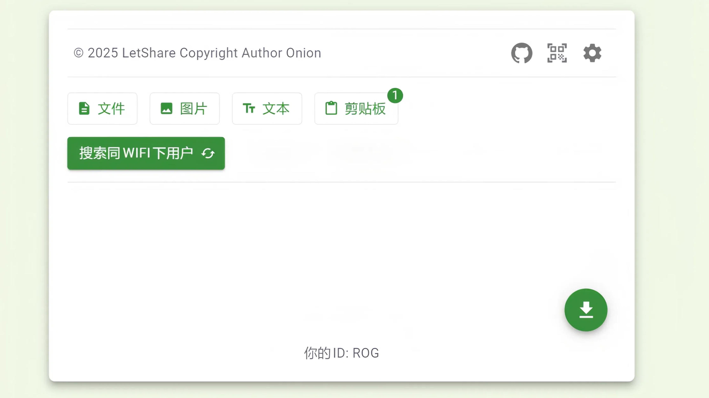

# 🚀 LetShare - 闪电般快速的安全文件分享

> **零注册 | 端到端加密 | 即时P2P传输 | 跨平台兼容**

[](https://letshare.fun)
[](#security)
[](#cross-platform)

[](LICENSE)  
[](https://vitejs.dev)  
[](https://webrtc.org)

**[🇺🇸 English Version](../README.md)**

---

## 🎯 为什么选择 LetShare？

**❌ 传统文件分享的痛点：**
- 上传到云服务器 → 隐私风险 & 速度慢
- 需要注册账号 → 繁琐流程 & 数据收集  
- 平台兼容性差 → iPhone ↔ Android 传输困难
- 文件大小限制 → 无法分享所需文件

**✅ LetShare 一次性解决所有问题：**
- 🚀 **直接P2P传输** - 你的网速 = 传输速度
- 🔐 **军用级加密** - 连我们都看不到你的文件
- 📱 **通用兼容性** - 任何设备，任何平台
- ⚡ **即时连接** - 扫描二维码，开始分享

---

## ✨ 核心功能

### 🔐 **企业级安全保护**
- **端到端加密**：ECDH + AES-256-GCM
- **数字签名**：ECDSA验证防止篡改
- **防中间人攻击**：公钥签名验证
- **零服务器存储**：文件永不触及我们的服务器

### ⚡ **闪电般性能**
- **WebRTC P2P**：设备间直接连接
- **无上传延迟**：跳过云端，直接传输
- **无文件大小限制**：仅受存储空间限制
- **实时进度**：传输过程实时监控

### 🌍 **通用兼容性**
- **网页浏览器**：Chrome、Firefox、Safari、Edge
- **移动原生应用**：通过 Capacitor 开发的 Android 应用
- **跨平台**：Windows ↔ Mac ↔ Linux ↔ Mobile
- **PWA 支持**：可安装为原生应用

### 🎯 **零摩擦体验**
- **无需注册**：打开即用
- **二维码配对**：扫码即时连接
- **拖拽分享**：直观的文件分享
- **多语言**：中文、English、Bahasa、Indonesia

---

## 🎬 实际演示



**🔥 30秒完整流程：**
1. 在两个设备上打开 LetShare
2. 扫描二维码建立连接
3. 拖拽文件或粘贴文本
4. 观看加密传输实时进行

---

## 🏗️ 技术架构


**🔧 技术栈亮点：**
- **前端**：React 18 + TypeScript + Vite
- **P2P**：WebRTC DataChannels
- **加密**：Web Crypto API (ECDH/ECDSA/AES-GCM)
- **UI**：Material-UI (MUI) 5
- **状态管理**：MobX 响应式更新
- **移动端**：Capacitor 原生应用
- **国际化**：react-i18next 自动检测

---

## 🚀 快速开始

### 🌐 **在线体验（推荐）**
```bash
👉 访问：https://letshare.fun
```
无需安装 - 在任何现代浏览器中立即使用！

### 💻 **本地开发**
```bash
# 克隆仓库
git clone https://github.com/LiWeny16/LetShare.git
cd LetShare

# 安装依赖
yarn install

# 启动开发服务器
yarn dev

# 构建生产版本
yarn build
```

### 📱 **构建 Android 应用**
```bash
# 设置 Capacitor
yarn app-create

# 构建并同步
yarn app

# 在 Android Studio 中打开
yarn app-start
```

---

## 🔐 安全特性 {#security}

### **加密流程**
1. **密钥生成**：为每个用户生成 ECDH P-256 密钥对
2. **密钥交换**：签名公钥分发
3. **共享密钥**：ECDH 衍生的 AES-256 密钥
4. **消息加密**：带认证的 AES-256-GCM
5. **完整性保护**：ECDSA 签名防止篡改

### **攻击防护**
- ✅ **中间人攻击**：公钥签名验证
- ✅ **重放攻击**：时间戳 + 随机数验证  
- ✅ **数据篡改**：密码学认证
- ✅ **窃听**：端到端加密

---

## 📊 对比矩阵

| 功能特性 | LetShare | AirDrop | WeTransfer | 百度网盘 |
|---------|----------|---------|------------|----------|
| **跨平台** | ✅ 通用 | ❌ 仅苹果 | ✅ 网页 | ✅ 网页 |
| **隐私保护** | ✅ 端到端加密 | ✅ 本地 | ❌ 服务器访问 | ❌ 服务器扫描 |
| **传输速度** | ✅ P2P 直连 | ✅ 本地 | ❌ 上传/下载 | ❌ 限速 |
| **文件大小** | ✅ 无限制* | ❌ 有限制 | ❌ 2GB上限 | ❌ 15GB配额 |
| **注册要求** | ✅ 无需 | ✅ 无需 | ❌ 必需 | ❌ 必需 |
| **离线使用** | ✅ 局域网可用 | ✅ 本地 | ❌ 仅限联网 | ❌ 仅限联网 |

*受设备存储和网络稳定性限制

---

## 🌍 支持平台 {#cross-platform}

### **网页浏览器**
- ✅ Chrome 88+（推荐）
- ✅ Firefox 84+
- ✅ Safari 14+
- ✅ Edge 88+

### **移动平台**
- ✅ Android 7.0+（原生应用）
- ✅ iOS 14+（PWA）
- ✅ 任何移动浏览器

### **桌面操作系统**
- ✅ Windows 10+
- ✅ macOS 10.15+
- ✅ Linux（任何发行版）

---

## 🛠️ 开发脚本

```bash
yarn dev
yarn build       
```

---

## 🤝 参与贡献

我们欢迎贡献！以下是你可以帮助的方式：

### **🐛 发现了 Bug？**
- 在 [issues](https://github.com/LiWeny16/LetShare/issues) 中提交，包含复现步骤

### **💡 有想法？**
- 查看我们的 [开发路线图](https://github.com/LiWeny16/LetShare/projects) 
- 在 [讨论区](https://github.com/LiWeny16/LetShare/discussions) 建议功能

### **🚀 想要贡献代码？**
1. Fork 此仓库
2. 创建功能分支：`git checkout -b feature/amazing-feature`
3. 提交更改：`git commit -m 'Add amazing feature'`
4. 推送分支：`git push origin feature/amazing-feature`
5. 开启 Pull Request

---

## 📝 许可证

本项目基于 **MIT 许可证** - 查看 [LICENSE](LICENSE) 文件了解详情。

---

## ⭐ 支持此项目

如果 LetShare 对你有帮助，请考虑：

- ⭐ **为此仓库点星** 表示支持
- 🐛 **报告 Bug** 帮助我们改进
- 💡 **分享想法** 提出新功能
- 🔄 **推荐给朋友** 需要安全文件分享的人
- ☕ **[请我们喝咖啡](https://ko-fi.com/bigonion)** 为开发提供动力

---

## 🔗 相关链接

- 🌐 **在线演示**：[letshare.fun](https://letshare.fun)
- 📱 **Android 应用**：[Google Play Store](https://play.google.com/store/apps/details?id=fun.letshare.app)
- 📧 **联系我们**：[hello@letshare.fun](mailto:hello@letshare.fun)
<!-- - 🐦 **Twitter**: [@LetShareApp](https://twitter.com/LetShareApp) -->

---

<div align="center">

**由相信隐私和简洁的开发者用 ❤️ 构建**

[⬆ 回到顶部](#-letshare---闪电般快速的安全文件分享)

</div>
